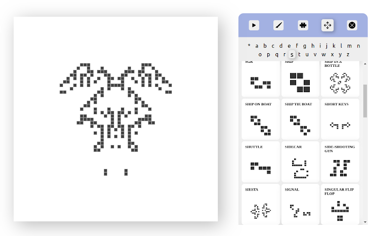

# Game of Life

Simulates the game of life created by the matematician John Conway.  
The patterns was taken from [this website](https://web.archive.org/web/20160325045805/http://argentum.freeserve.co.uk/lex.htm).

### Preview

If you want to preview click [here](https://viniciusrplima.github.io/game-of-life/). 

  

